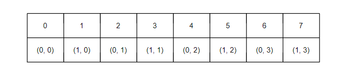
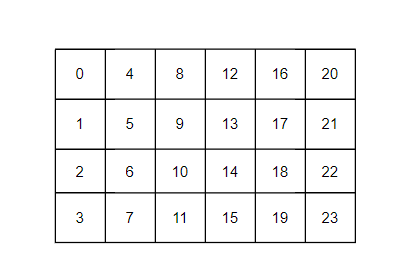
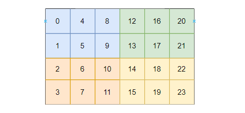
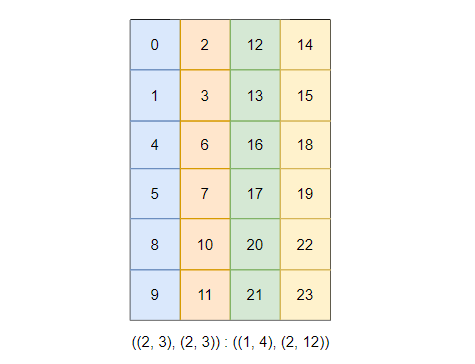

# Composition (复合运算)
在数学里面，函数复合是$f(g(x))$
在Cute里面，对于Layout_A和Layout_B，他们之间的复合就是：
Layout_C = composition(Layout_A, Layout_B)
一般情况下，Layout_A描述了真实的物理内存布局，Layout_B表示期望的逻辑访问顺序。Layout_C相当于是带上了一幅"定制眼镜"，可以完成逻辑坐标到物理内存偏移的映射
流程如下：
1. 输入坐标x通过layout_B获得一维索引y
2. 一维索引y通过layout_A得到layout_A下的二维坐标
3. 根据这个二维坐标获得物理内存偏移

假如内存中有一块8个元素的数据(2行4列)，列优先存储，Layout_A就是(2, 4) : (1, 2)

可以根据一个一维索引和二维坐标之间建立映射(注意一定是列方向的)


下面我们希望转置访问这个矩阵，定义Layout_B = (4, 2) : (2, 1)
下面根据一维逻辑索引计算中间值:
--------------------
| 一维逻辑索引     |   0   |   1   |   2   |   3   |   4   |   5   |   6   |   7   |
| :--------------- | :---: | :---: | :---: | :---: | :---: | :---: | :---: | :---: |
| 计算的一维中间值 |   0   |   2   |   4   |   6   |   1   |   3   |   5   |   7   |
-------------------

然后计算中间值到Layout_A二维坐标的映射，可以得到index
--------------------
| 一维逻辑索引     |   0   |   1   |   2   |   3   |   4   |   5   |   6   |   7   |
| :--------------- | :---: | :---: | :---: | :---: | :---: | :---: | :---: | :---: |
| 计算的一维中间值 |   0   |   2   |   4   |   6   |   1   |   3   |   5   |   7   |
| 二维坐标         | (0,0) | (0,1) | (0,2) | (0,3) | (1,0) | (1,1) | (1,2) | (1,3) |
| index/偏移       |   0   |   2   |   4   |   6   |   1   |   3   |   5   |   7   |
--------------------
会发现访问顺序变成了行优先的顺序。

总结一下，composition(layout_A, layout_B)就是将A中的元素，按照Layout_B重新排布.(但是只是逻辑层面的，物理层面并没有发生变化)


# Complement（补集运算）
Composition 是“重新排列已有的东西”，那么 Complement 就是**“寻找缺失的拼图”**
假如有一块连续内存，包含8个元素0 1 2 3 4 5 6 7
现在有Layout_A = 4 : 2
可以知道Layout_A看到的是上面的0 2 4 6。那问题来了，怎么描述剩下的 1 3 5 7呢？

在cute里面，调用补集函数来完成：
layout_B = complement(alyout_A, 8)，8是目标内存总大小
计算得到的layout_B = 2 : 1
含义是
* 平移的步长是1
* 平移的次数是2，才能填满整个空间(偏移0和1)

可以将Layout_A和Layout_B组合起来
layout_C = make_layout(layout_A, layout_B) = (4, 2) : (2, 1), 这就是后面要讲的divide的操作


# logic_divide(Tiling)
逻辑除法，本质上就是**自动构造Tile块和Tile的补集，然后将它们嵌套在一起**
## 一维的逻辑除法
一块连续内存，大小为8， Layout_A = (8) : (1)，将其切分成大小为4的小块(Tile)
 Layout_B = logical_divide(Layout_A, 4)ruxia
会返回一个嵌套结构
 Layout_B = ((4), (2)) : ((1), (4))
含义如下：
 ((块内坐标), (块间坐标)) : ((块内步长), (块间步长))

## 二维矩阵的逻辑除法
现在有一个4 x 6的矩阵，列优先存储
Layout_A = (4, 6) : (1, 4)

希望用一个2 x 3的Tile去切分它
Layout_B = logical_divide(Layout_A, Shape(2, 3))
Cute会在每一个维度上独立做除法  
* 行方向：4行除以2 → 块内2行，总共2个块
* 列方向：6列除以3 → 块内3列，总共2个块

divide的诸多变体在最后一步展现出了差异

## logic_divide
返回的结构是 ((行内), (行外)) , ((列内), (列外))
实际返回的就是：((2, 2), (3, 2)) : ((1, 2), (4, 12))
也就是：

这个方式保留了原矩阵的二维特性（左边全是行信息，右边全是列信息）。当你需要做一些只针对某一个维度的操作时（比如在行方向上做 Reduce/求和，或者单纯提取列的属性），这种结构最方便

## zipped_divide
内部操作是：先调用 logical_divide，然后做一次类似矩阵转置的 zip（拉链）操作，把内层相同的属性提取到一起
```c++
template <class LShape, class LStride, class Tiler>
CUTE_HOST_DEVICE constexpr
auto
logical_divide(Layout<LShape,LStride> const& layout,
               Tiler                  const& tiler)
{
  if constexpr (is_tuple<Tiler>::value) {
    static_assert(tuple_size<Tiler>::value <= Layout<LShape,LStride>::rank, "logical_divide: Too many modes in tiler.");
    return transform_layout(layout, tiler, [](auto const& l, auto const& t) { return logical_divide(l,t); });
  } else if constexpr (is_underscore<Tiler>::value) {
    return layout;
  } else if constexpr (is_integral<Tiler>::value) {
    return logical_divide(layout, make_layout(tiler));
  }

  CUTE_GCC_UNREACHABLE;
}
```
返回的结构是：((块内坐标), (块间坐标)) : ((块内步长), (块间步长))  

 Layout_B = ((2, 3), (2, 2)) : ((1, 4), (2, 12))


这个变体返回的结果是完美的(Tile, Rest)结构，方便我们进行不同层级的划分，例如(2, 3)的tile分配给单个CTA，而将后面的(2, 3)分配给BlockIdx.x和BlockIdx.y

## tiled_divide：为硬件Intrinsic(内置指令)而生的高级除法
前两个除法解决的是shape的切分，tiled_divide 解决的是物理排布(Layout)的映射。

假设Tile代表的是一个线程组的Layout，这里就是用6个线程处理这个2 x 3的Tile，线程Layout是(2, 3) : (3, 1)，这符合相邻线程读取相邻元素的约定

此时调用tiled_divide(A, thread_layout)，内部会做3件事
1. 提取thread_layout的shape (2, 3)
2. 执行zipped_divide，得到的是((2, 3), (2, 2))
3. 会将第一部分的块内结构，和thread_layout的进行一次Composition
```c++
// Same as zipped_divide, but unpacks the second mode: ((BLK_A,BLK_B,...),a,b,...,x,y)
template <class LShape, class LStride,
          class Tiler>
CUTE_HOST_DEVICE constexpr
auto
tiled_divide(Layout<LShape,LStride> const& layout,
             Tiler                  const& tiler)
{
  auto result = zipped_divide(layout, tiler);

  auto R1 = rank<1>(result);
  return result(_, repeat<R1>(_));
}
```
返回的是(flattented_Tile, Rest)：将原本块内结构(2,3)，根据线程排布拉平(Flatten)成一维的6

这个设计用于将把你的一维线程 ID，正确地映射成列优先或行优先的二维坐标，再算出最终的内存地址。

